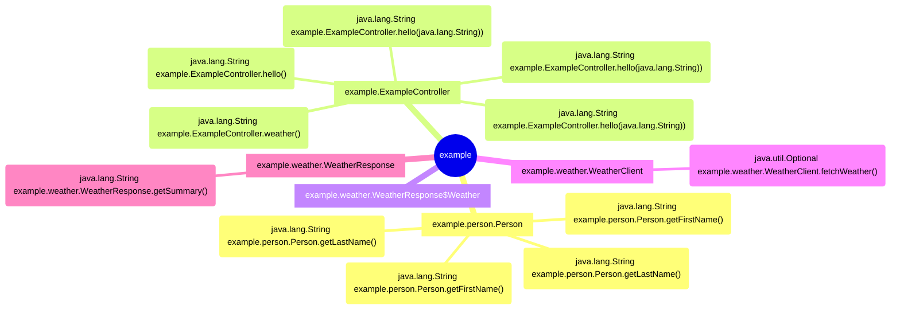

```mermaid
mindmap
  root((example))
    ["example.person.Person"]
      ("java.lang.String example.person.Person.getFirstName()")
      ("java.lang.String example.person.Person.getFirstName()")
      ("java.lang.String example.person.Person.getLastName()")
      ("java.lang.String example.person.Person.getLastName()")
    ["example.ExampleController"]
      ("java.lang.String example.ExampleController.weather()")
      ("java.lang.String example.ExampleController.hello()")
      ("java.lang.String example.ExampleController.hello(java.lang.String))")
      ("java.lang.String example.ExampleController.hello(java.lang.String))")
      ("java.lang.String example.ExampleController.hello(java.lang.String))")
    ["example.weather.WeatherResponse$Weather"]
    ["example.weather.WeatherClient"]
      ("java.util.Optional example.weather.WeatherClient.fetchWeather()")
    ["example.weather.WeatherResponse"]
      ("java.lang.String example.weather.WeatherResponse.getSummary()")
```