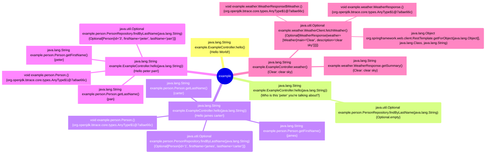

```mermaid
mindmap
  root((example))
    ["java.lang.String example.ExampleController.hello()</br>{Hello World!}"]
    ["java.lang.String example.ExampleController.hello(java.lang.String))</br>{Who is this 'peter' you're talking about?}"]
      ("java.util.Optional example.person.PersonRepository.findByLastName(java.lang.String)</br>{Optional.empty}")
    ["java.lang.String example.ExampleController.hello(java.lang.String))</br>{Hello james carter!}"]
      ["void example.person.Person.<init>()</br>{org.openjdk.btrace.core.types.AnyType$1@7a8ae66c}"]
      ["java.lang.String example.person.Person.getFirstName()</br>{james}"]
      ["java.lang.String example.person.Person.getLastName()</br>{carter}"]
      ("java.util.Optional example.person.PersonRepository.findByLastName(java.lang.String)</br>{Optional[Person{id='1', firstName='james', lastName='carter'}]}")
    ["java.lang.String example.ExampleController.hello(java.lang.String))</br>{Hello peter pan!}"]
      ["void example.person.Person.<init>()</br>{org.openjdk.btrace.core.types.AnyType$1@7a8ae66c}"]
      ["java.lang.String example.person.Person.getFirstName()</br>{peter}"]
      ["java.lang.String example.person.Person.getLastName()</br>{pan}"]
      ("java.util.Optional example.person.PersonRepository.findByLastName(java.lang.String)</br>{Optional[Person{id='3', firstName='peter', lastName='pan'}]}")
    ["java.lang.String example.ExampleController.weather()</br>{Clear: clear sky}"]
      ["java.util.Optional example.weather.WeatherClient.fetchWeather()</br>{Optional[WeatherResponse{weather=[Weather{main='Clear', description='clear sky'}]}]}"]
        ["void example.weather.WeatherResponse.<init>()</br>{org.openjdk.btrace.core.types.AnyType$1@7a8ae66c}"]
        ["void example.weather.WeatherResponse$Weather.<init>()</br>{org.openjdk.btrace.core.types.AnyType$1@7a8ae66c}"]
        ("java.lang.Object org.springframework.web.client.RestTemplate.getForObject(java.lang.Object[], java.lang.Class, java.lang.String)")
      ["java.lang.String example.weather.WeatherResponse.getSummary()</br>{Clear: clear sky}"]
```